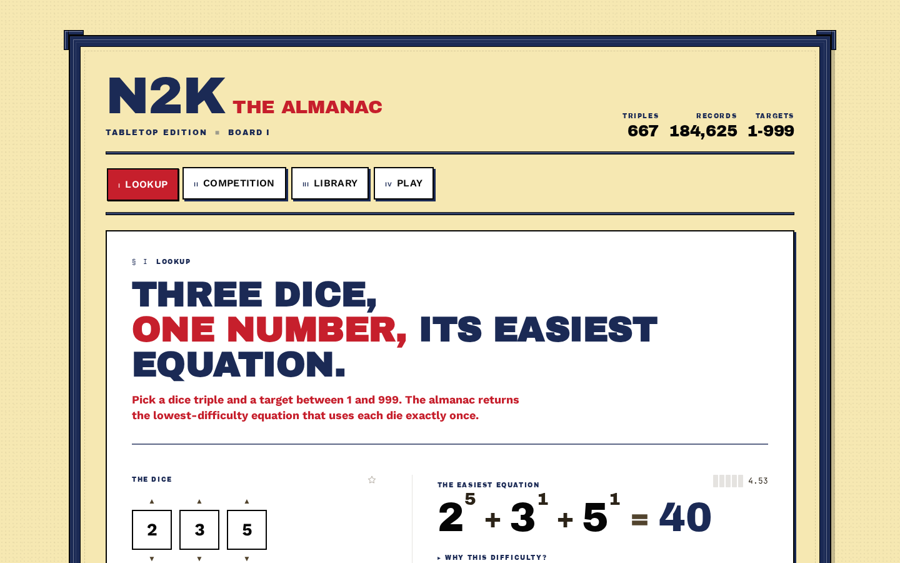

# N2K Platform



[](https://n2k-almanac-v3.web.app)
[](https://www.typescriptlang.org/)
[](https://react.dev/)
[](https://mobx.js.org/)
[](https://vite.dev/)

N2K is a mental-math dice game: you get a few dice and a target number, and you
have to build an equation of the form `d1^p1 op1 d2^p2 op2 d3^p3 = total`,
evaluated strictly left to right, that hits the target. The hard part while
playing is knowing whether a cell is even solvable, and how hard it is compared
to the one next to it.

This repo answers that. A TypeScript solver precomputes the easiest equation for
every roll in the standard game, packs the answers into a bit-packed binary
format, and the web app loads that blob and answers lookups instantly. On top of
the lookup sit a competition builder, a local library of saved competitions, and
60-second knockout races against bot personas.

**Live:** [n2k-almanac-v3.web.app](https://n2k-almanac-v3.web.app)

## What you can do with it

**Lookup** takes a dice combination and a target and gives you the easiest valid
equation. **Competition** builds boards, generates balanced rolls, lets you pin
cells, and exports match materials. **Library** holds your saved competitions
with stats, history, thumbnails, and a way back into a match. **Play** runs a
60-second knockout race against a bot persona, or walks a saved competition as a
sequence of bouts. There is also a terminal REPL that can solve, sweep, explain,
generate boards, inspect rolls, and rebuild datasets. The UI ships 17 themed
editions, each of which picks one of 12 reusable layout primitives.

Æther mode is the expanded ruleset: wider dice ranges (−10..32), targets up to
5,000, and arity 3, 4, and 5 equations. It runs through the same solver and the
same difficulty heuristic as the standard game, because mode is data rather than
a second code path. On the web it is unlocked with a Konami sequence; in the CLI
it is `--mode aether`.

## How it works

The whole thing is a static React SPA. There is no server and no account
system. Everything you save lives in your browser's localStorage.

The dataset is the interesting part. `standard.n2k` (~1 MB) covers every
standard dice combination crossed with targets 1 to 999, and loads eagerly.
`aether-arity3.n2k` (~31 MB) covers every Æther 3-tuple against targets 1 to
5,000 and loads lazily on the first Æther query. Arity 4 and 5 have no full
blob, because the file would be unmanageable, so only curated "commons" tuples
are baked and everything else falls back to a Web Worker solver pool at runtime.
The fallback chain lives in one place, `AetherDataStore.sweep`.

The bit-packed format itself is `src/core/n2kBinary.ts` (a BitReader/BitWriter
plus chunk encode and decode) with `src/core/n2kBlob.ts` wrapping chunks into a
file container. Baking runs a `worker_threads` pool over the exporter.

Dependencies run one way only:

```text
UI -> Stores -> Services -> Core
```

UI observes stores and dispatches actions. Stores own reactive state and
orchestrate services. Services are stateless and pure, with no MobX and no DOM.
Core holds types, constants, the equation model, and the binary format, and has
zero runtime dependencies. Features never import each other. The solver
workspace and the web app share the same domain assumptions, so the CLI,
exported datasets, bot play, and browser lookup all agree on what is legal and
how hard it is.

Two seams exist for things that do not exist yet. `ContentBackend`
(`web/src/services/contentBackend.ts`) is the document store interface;
`LocalStorageContentBackend` is the only implementation, and the point of the
interface is that a cloud backend can drop in without touching call sites. The
`Game<>` kernel (`src/services/gameKernel.ts`) requires serializable state and a
pure `applyMove`, which makes replays `(initialState, moveLog)` and would let
multiplayer arrive as a different `Player` implementation over a network
transport. `n2kClassic` is the only registered game today.

## Tech

| Area | Tools |
| --- | --- |
| Solver/core | TypeScript, Node 20, Vitest |
| Web app | React, MobX, Vite, Tailwind |
| Data pipeline | TSX scripts, worker threads, custom `.n2k` blobs |
| Testing | Vitest, Playwright, performance harnesses |
| Hosting | Firebase Hosting |

## Layout

```text
src/core/        # types, constants, binary format, equation model
src/services/    # solver, parser, difficulty, generators, exporter, game kernel
src/games/       # N2K Classic and its bot players
src/cli/         # terminal REPL
scripts/         # dataset export and bake scripts
tests/           # root Vitest suites
web/public/data/ # .n2k dataset blobs
web/src/         # core/ services/ stores/ features/ ui/ workers/
web/tests/       # web unit, integration, and perf tests
web/e2e/         # Playwright smoke and responsive flows
docs/            # architecture, roadmap, changelog, planning notes
```

## Running it

There are two npm roots, the repo root and `web/`, and each needs its own
install.

Root solver workspace:

```bash
npm install
npm test
npm run typecheck
npm run cli
```

Web app:

```bash
cd web
npm install
npm run dev
npm test
npm run test:perf
npm run test:e2e     # Playwright; needs npx playwright install first
npm run build
```

Dataset tools, from the repo root:

```bash
# Rebuild the standard browser lookup blob
npm run bake -- --mode standard

# Rebuild the arity-3 Aether blob
npm run bake -- --mode aether-arity3

# Export JSON/binary projections for tooling
npm run export
```

Baking is expensive. Arity-4 commons takes hours and a full arity-5 bake is
roughly 21 hours, so the checked-in blobs are not something to regenerate
casually.

## Deploying

Build in `web/`, then deploy from the repo root, where `firebase.json` lives:

```bash
cd web && npm run build && cd ..
firebase deploy --only hosting:almanac
```

The live target is
[n2k-almanac-v3.web.app](https://n2k-almanac-v3.web.app). Blobs and `assets/**`
are served with 1-year immutable cache headers, so a dataset change needs a new
filename or a hard refresh to show up.

## Performance harness

`web/tests/perf/` is a deliberate regression net: render-count baselines per
surface via a React Profiler wrapper, MobX fanout assertions that unrelated
store slices do not re-fire each other's reactions, and microbenches on
`easiestSolution` and `parseEquation` with budgets at 3x the observed median,
floored at 5 ms. Caps get tightened after a verified win and never loosened to
quiet a flaky run, because a flake means the harness is wrong rather than the
budget. Baselines are in [docs/perf-baseline.md](docs/perf-baseline.md).

## What this doesn't do

- No accounts, profiles, or global leaderboards. All state is per-browser
  localStorage, so clearing site data loses saved competitions and stats.
- No analytics, which means no visibility into how the live site is actually
  used.
- localStorage caps out around 5 MB. A large competition library will eventually
  need the IndexedDB backend. The seam exists, the implementation doesn't.
- Æther arity-5 coverage is partial. Only the first 50 canonical commons tuples
  are baked; the rest fall back to a live worker sweep that takes seconds.
- `aether-arity3.n2k` (~31 MB) and `aether-arity4-commons.n2k` (~38 MB) are
  tracked in git, so clones are heavy. Both are under GitHub's 100 MB per-file
  limit, but future bakes should watch it.
- No ESLint and no CI. Verification is manual.
- `web/index.html` pulls about 25 font families from Google Fonts at runtime
  rather than self-hosting them. The service worker runtime-caches them, so a
  font you have seen online keeps working offline, but one you have never
  visited won't be available offline.

No Firestore, no auth, no real multiplayer transport, and no AI-generated
themes. The seams are there; the implementations are not.

## Docs

- [Architecture](docs/architecture.md) covers the layers, dataset format, exact
  commands, and limitations in more detail.
- [Roadmap](docs/roadmap.md) is the Now/Next/Later plan.
- [Changelog](docs/changelog.md) is the session log, newest first.
- [Aether arity plan](docs/plan-aether-arity-mixes.md) covers the higher-arity
  coverage work.
